# Manuale utente

Questo manuale è stato realizzato su sistema Linux (OS Ubuntu), sono state riscontrate svariate problematiche durante l'installazione di Brownie su sistema Windows, quindi si sconsiglia l'installazione su questo tipo di sistema operativo.

## Installazione degli strumenti

### Installazione wallet metamask

Come prima cosa, se non si ha ancora un wallet metamask installato, si deve installare l'estensione [metamask](https://metamask.io/download/).
Dopo aver installato l'estensione bisognerà creare un nuovo wallet, oppure se si vuole utilizzare un wallet già esistente si potrà semplicemente importarlo.

Per la creazione di un nuovo wallet, sarà necessario seguire i seguenti passi:

<p align="center">
  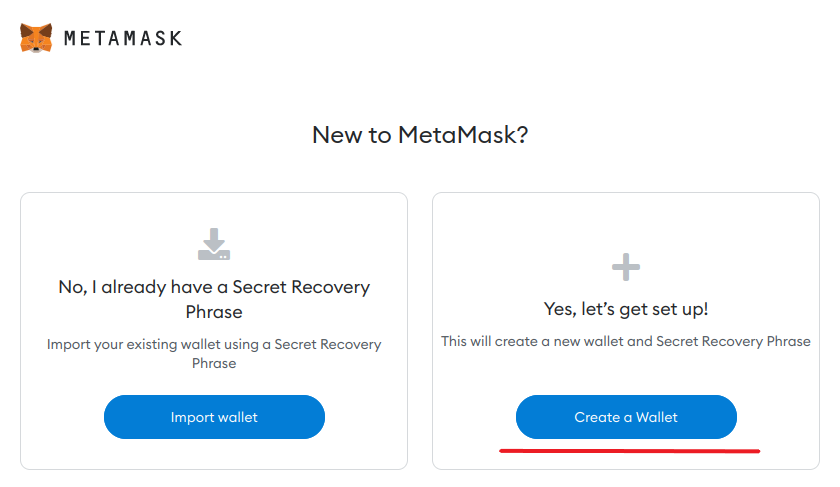
</p>

Dopo aver creato il wallet, l'estensione chiederà di impostare una password, questa è importante ma non necessaria per il recupero del wallet, soltanto il seed che vi verrà mostrato successivamente potrà essere utilizzato per recuperare il wallet; la password è soltanto un meccanismo di sicurezza in più per il tuo hot wallet.

<p align="center">
  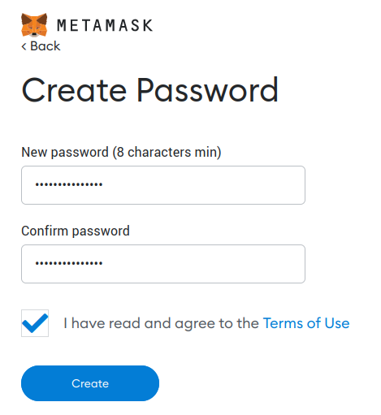
</p>

A questo punto metamask vi mostrerà il seed, che ovviamente dovrà essere custodito in maniera sicura, preferibilmente su un pezzo di carta da nascondere, o se lo si vuole salvare su un dispositivo elettronico bisognerebbe assicurarsi che tale dispositivo sia air-gapped.

<p align="center">
  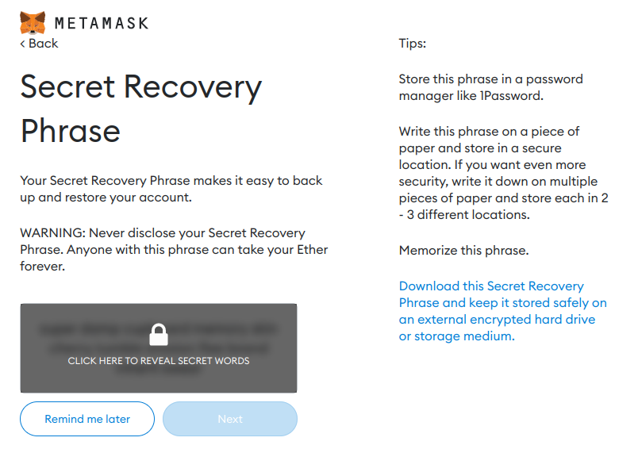
</p>

Dopo aver custodito il seed, metamask vi chiederà di inserire parte dello stesso per verificare che lo abbiate effettivamente memorizzato.

<p align="center">
  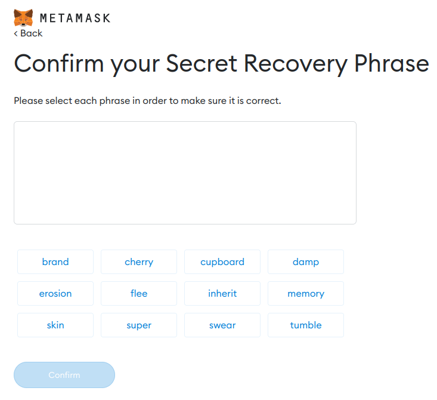
</p>

Se tutto è andato a buon fine, alla fine del setup dovreste visualizzare la pagina principale di Metamask che vi mostra il saldo dell'account, l'indirizzo e tante altre informazioni.

<p align="center">
  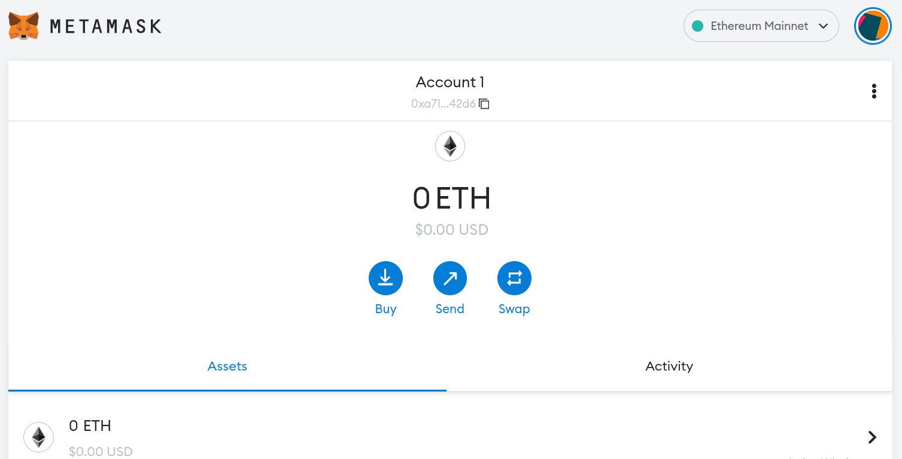
</p>

### Alchemy 

Dopo aver effettuato il login, oppure, dopo essersi registrati al seguente [link](https://auth.alchemyapi.io/?redirectUrl=https%3A%2F%2Fdashboard.alchemyapi.io) sarà possibile creare un'applicazione mediante la quale sarà possibile ottenere una api key per l'accesso al nodo rpc di alchemy, che servirà successivamente per interagire con la rete scelta. 

In questo esempio, abbiamo scelto di creare un progetto sulla rete testnet di Ethereum chiamata Rinkeby, per la creazione abbiamo seguito i seguenti passaggi:

<p align="center">
  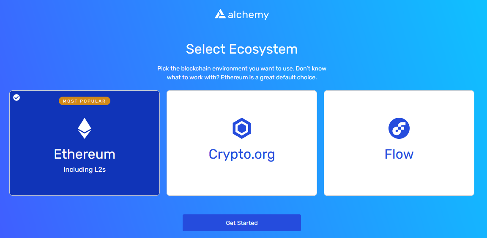
</p>

<p align="center">
  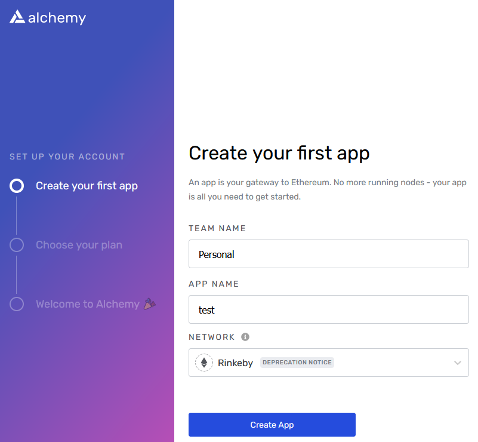
</p>

Come piano, ovviamente, è stato scelto un piano gratuito, che ovviamente avrà un numero di richieste limitate, ma che per il nostro scopo sarà più che necessario.

<p align="center">
  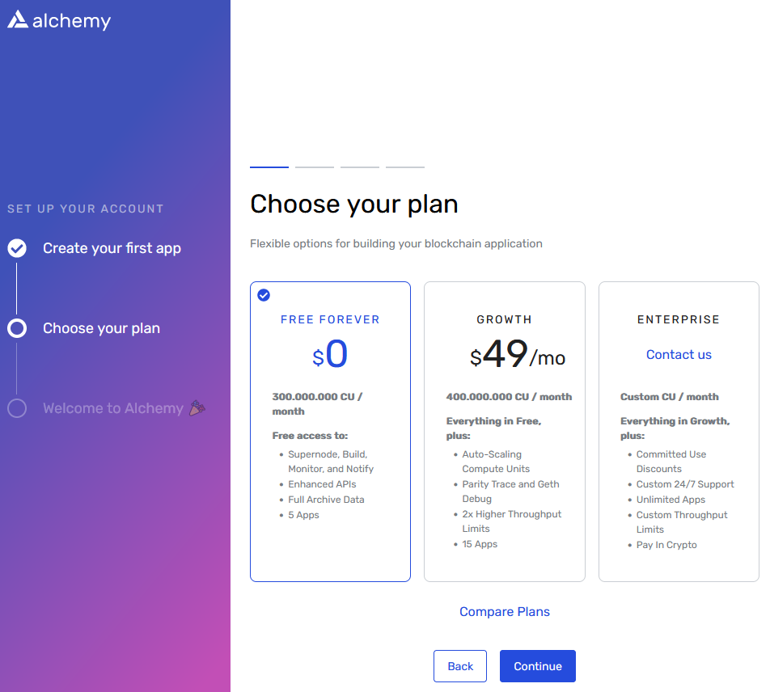
</p>

Dopo aver per lo più saltato i passaggi riguardanti i metodi di pagamento, dovremmo trovarci di fronte ad una schermata simile:

<p align="center">
  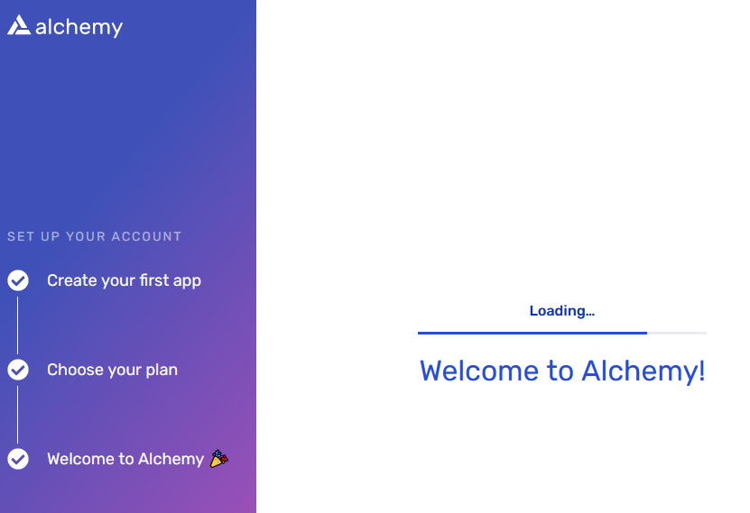
</p>

Una volta completati tutti questi passaggi, avremo accesso alla [dashboard](https://dashboard.alchemyapi.io/) dove sarà presente il progetto che abbiamo appena creato, cliccando sul relativo pulsante saremo, inoltre, in grado di ottenere l'api key della quale avevamo bisogno.

<p align="center">
  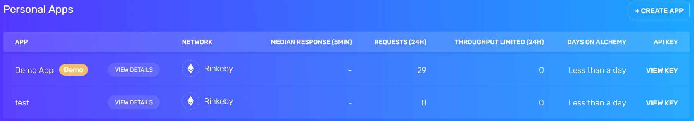
</p>

### Etherscan 

Dopo aver effettuato il login oppure dopo essersi registrati, al seguente [link](https://etherscan.io/login) sarà possibile ottenere una api key, che servirà successivamente per verificare su Etherscan gli smart contract distribuiti.

<p align="center">
  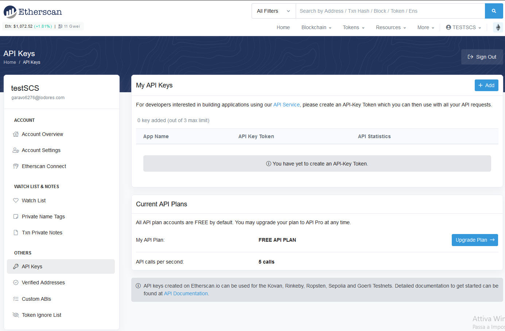
</p>

Una volta che si è sulla giusta pagina, è possibile ottenere la chiave, cliccando sul pulsante "Add" e poi su "Create New API Key".

<p align="center">
  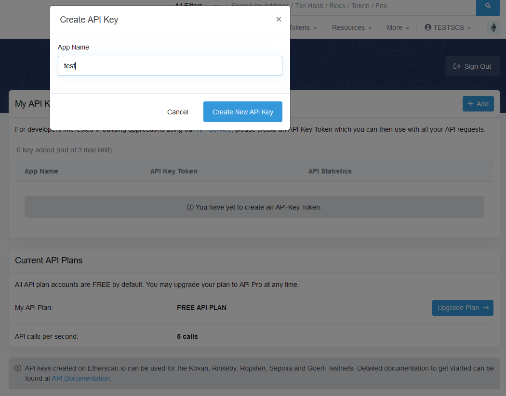
</p>

### Brownie   

E' possibile effettuare l'installazione di brownie, seguendo le istruzioni riportate sul seguente [link](https://eth-brownie.readthedocs.io/en/stable/install.html)

In questo caso è stata preferita l'installazione mediante `pip`

```
user@pc:~$ sudo apt install python3-pip
user@pc:~$ pip install eth-brownie
```

Se il tutto ha avuto esito positivo, saremo ora in grado di utilizzare brownie, che ci servirà successivamente per la distribuzione degli smart contract e per l'esecuzione del PoC.

<p align="center">
  
</p>

## Distribuzione degli smart contract

Per poter distribuire gli smart contract, sarà necessario che nel wallet siano presenti degli Ether.

A questo proposito, verranno utilizzati dei siti chiamati faucet per ottenere una certa quantità di Ether, che sarà sufficiente per quello di cui abbiamo bisogno; i faucet, in generale, esistono solo per reti testnet e cambiano da rete a rete, in questo caso, per la testnet Rinkeby di Ethereum, quelli che abbiamo utilizzato sono:

- https://faucet.paradigm.xyz/ distribuisce 0.5 ETH per richiesta, potrà essere utilizzato ogni 24 ore e per poter essere utilizzato si deve collegare un account Twitter (account sospetti potrebbero non essere accettati)
- https://rinkebyfaucet.com/ distribuisce 0.5 ETH per richiesta se si collega l'account Alchemy, mentre solo 0.1 ETH senza collegare alcun account e potrà essere utilizzato ogni 24 ore
- https://faucets.chain.link/rinkeby distribuisce 0.1 ETH per richiesta e potrà essere utilizzato ogni ora

Dopo essersi procurati la giusta quantità di Ether utile ad effettuare le transazioni per la distribuzione degli smart contract, sarà possibile utilizzare `brownie`, installato precedentemente, per eseguire lo script che abbiamo preparato per la distribuzione dei token ERC20 fittizi e della dapp. A questo proposito, per poter utilizzare `brownie` e interagire con la rete testnet Rinkeby di Ethereum dovremo anche utilizzare la chiave API di `Alchemy` ed inoltre per ottenere la verifica degli smart contract su Etherscan dovremo utilizzare anche la chiave API di `Etherscan`, entrambe ottenute in precedenza.
Inoltre per poter utilizzare il wallet, creato al primo step, dovremo anche esportare la private key dell'account da Metamask e inserire le seguenti linee di codice nel file `brownie-config.yaml`

Per cominciare cloniamo la repository presente su github:

```
user@pc:~$ git clone https://github.com/Lu191/SmartContractsSecurity
```

Se non si ha il software git installato, procediamo con l'installazione, e poi, ripetiamo il comando precedente:

```
user@pc:~$ sudo apt install git
```

Per ottenere la chiave privata del wallet appena creato (o anche di uno importato), bisogna prima cliccare sui tre puntini, e poi su "Account details":

<p align="center">
  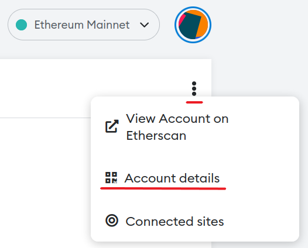
</p>

Successivamente sarà possibile esportare la chiave privata (ovviamente questa non va condivisa con nessuno, altrimenti qualcun altro potrà aver accesso al tuo wallet e ai tuoi fondi):

<p align="center">
  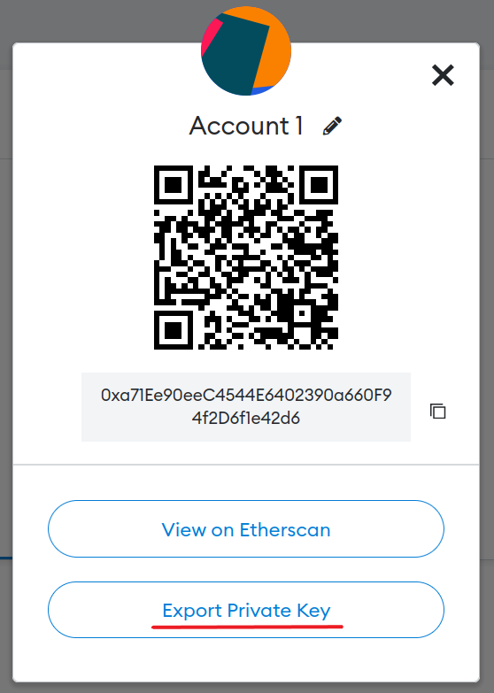
</p>

Una volta ottenuta la chiave privata, dovremo aggiungere le seguenti linee di codice al file `brownie-config.yaml` presente nella cartella `dapp`, sostituendo la stringa `"YOUR_PRIV_KEY"` con la chiave privata esportata.

<p align="center">
  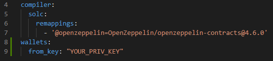
</p>

Per poter fare in modo che `brownie` conosca quali sono le chiavi API di `Alchemy` e `Etherscan` bisognerà aggiungere tali chiavi mediante due variabili d'ambiente sostituendo rispettivamente `"YOUR_ETHERSCAN_API_KEY"` con la chiave API ottenuta da `Etherscan` e `"YOUR_ALCHEMY_API_KEY"` con la chiave API ottenuta da `Alchemy`:

```
user@pc:~$ export ETHERSCAN_TOKEN=YOUR_ETHERSCAN_API_KEY
user@pc:~$ export WEB3_ALCHEMY_PROJECT_ID=YOUR_ALCHEMY_API_KEY
```

A questo punto, saremo in grado di poter distribuire i nostri smart contract sulla testnet Rinkeby di Ethereum mediante l'utilizzo di `brownie`:

```
user@pc:~$ cd dapp
user@pc:~$ brownie networks set_provider alchemy
user@pc:~$ brownie run scripts/deploy.py --network rinkeby
```

## Installazione frontend della dapp

Per prima cosa si dovrebbero installare i pacchetti `nodejs` e `npm`:

```
user@pc:~$ sudo apt install nodejs npm
```

Anche il front end dell'applicazione necessita della chiave API di `Alchemy` per interagire con la testnet Rinkeby di Ethereum, perciò bisognerà aggiungere la chiave all'interno di una variabile d'ambiente chiamata `REACT_APP_ALCHEMY_RPC` all'interno di un file `.env` nella cartella `ui`:

```
user@pc:~$ cd ui
user@pc:~$ echo "REACT_APP_ALCHEMY_RPC=https://eth-rinkeby.alchemyapi.io/v2/YOUR_API_KEY" >> .env
```

Successivamente per installare e avviare l'applicazione in locale:

```
user@pc:~$ cd ui
user@pc:~$ npm install && npm start
```

Come potete notare, manca ancora qualcosa, il grafico non viene ancora caricato correttamente, questo perchè avremo bisogno anche di un back end che metta a disposizione delle API per il fetch delle informazioni utili al riempimento del grafico.

## Installazione backend della dapp

Per il backend avremo bisogno anche di un database, in questo caso, abbiamo scelto di utilizzare come DBMS PostgreSQL hostato su una piattaforma chiamata Heroku. Dopo essersi registrati su Heroku, creato il database e aver ottenuto la stringa di connessione al database (potete effettuare le suddette operazioni seguendo questa [guida](https://dev.to/prisma/how-to-setup-a-free-postgresql-database-on-heroku-1dc1)), possiamo continuare con i passaggi successivi.

```
user@pc:~$ cd backend
user@pc:~$ echo "DATABASE_URL=YOUR_DB_CONNECTION_STRING" >> .env
```

Abbiamo inoltre utilizzato prisma come ORM (Object-Relational Mapping) che si integra perfettamente con il framework che abbiamo scelto per la realizzazione delle API ovvero Next.js ed inoltre semplifica l'accesso al database, fornisce un boilerplate per API di tipo CRUD (Create, Read, Update, Delete) e assicura una maggiore sicurezza. Inoltre, con Next.js possiamo utilizzare facilmente Vercel per l'hosting delle API.

Per provare il tutto sempre localmente, possiamo per prima cosa installare la Vercel CLI e provare ad eseguire il tutto in locale:

```
user@pc:~$ sudo npm -g install vercel
user@pc:~$ cd backend
user@pc:~$ npm install && vercel dev
```

A questo punto, Vercel ci farà effettuare il login mediante un account, noi in questo caso ci siamo collegati tramite `Github` e successivamente, dopo il settaggio di varie impostazioni, avremo il server con le api disponibili per l'utilizzo:

<p align="center">
  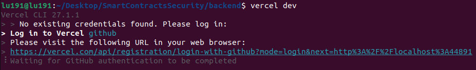
</p>

<p align="center">
  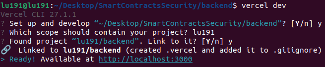
</p>

Siccome, molto probabilmente avremo anche il front end attivo, e poichè il front end utilizza già la porta 3000, possiamo istruire Vercel ad utilizzare un'altra porta, in questo caso la 3001.

```
user@pc:~$ cd backend
user@pc:~$ vercel dev --listen 3001
```

Ora che le API sono attive possiamo finalmente collegare il back end al front end per una corretta visualizzazione del grafico, in questo caso quindi dovremo semplicemente aggiungere un'altra variabile d'ambiente al file `.env` presente nella cartella `ui`

```
user@pc:~$ cd ui
user@pc:~$ echo "REACT_APP_API_CHART=http://localhost:3001/api/assets" >> .env
```

Il database dovrà essere riempito mediante lo script presente nella cartella `graph` che dovrà essere eseguito ogni giorno

```
user@pc:~$ cd graph
user@pc:~$ npm install
user@pc:~$ echo "REACT_APP_ALCHEMY_RPC=https://eth-rinkeby.alchemyapi.io/v2/YOUR_API_KEY" >> .env
user@pc:~$ node index.js http://localhost:3001/api/asset
```

Ovviamente, su un server in produzione, lo script potrà essere esegutio semplicemente mediante un cronjob che verrà eseguito ogni giorno:

```
crontab -e fill_db
30 9 * * * node /path_to_graph/index.js http://localhost:3001/api/asset
service crond restart
```

Per esempio, in questo caso, mediante un cronjob chiamato fill_db, il db sarà riempito mediante lo script ogni giorno alle 9:30.

## PoC e lancio dell'exploit

In questa fase, avremo già a disposizione tutto quello che ci servirà per lanciare l'exploit, infatti ci basterà, lanciare le rispettive funzioni dello script `exploit.py` presente nella cartella `scripts` con `brownie`:

```
user@pc:~$ cd dapp
user@pc:~$ brownie networks set_provider alchemy
user@pc:~$ export ETHERSCAN_TOKEN=YOUR_ETHERSCAN_API_KEY
user@pc:~$ export WEB3_ALCHEMY_PROJECT_ID=YOUR_ALCHEMY_API_KEY
```

Se si vuole provare il PoC attaccando una copia dello smart contract nuova, allora bisognerà lanciare la funzione main dello script, la quale accetta tre parametri, dei quali solo il primo relativo al deposito iniziale è obbligatorio, invece il secondo serve solo a specificare se si vuole verificare i contratti su Etherscan (`True` o `False`)

```
user@pc:~$ brownie run scripts/exploit.py main AMOUNT --network rinkeby
```

<p align="center">
  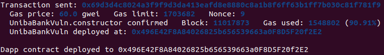
</p>

Se invece, si vuole provare su uno smart contract già esistente di UnibaBank (come ad esempio per quello dello screen mostrato poco sopra, dovremmo aggiungere il terzo parametro **`0x496E42F8A84026825b656539663a0F8D5F20f2E2`**) allora si dovrà aggiungere un ulteriore parametro che specifica l'indirizzo dello smart contract

```
user@pc:~$ brownie run scripts/exploit.py main AMOUNT False UNIBANK_CONTRACT_ADDRESS --network rinkeby
```

<p align="center">
  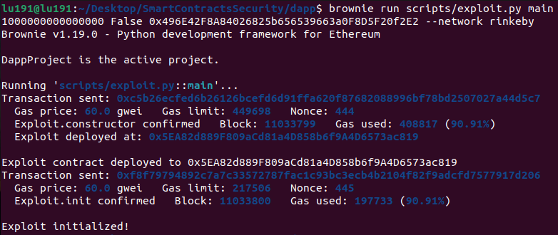
</p>

A questo punto possiamo copiare l'indirizzo del contratto malevolo appena distribuito e lanciare l'attacco.

```
user@pc:~$ brownie run scripts/exploit.py launchExploit EXPLOIT_CONTRACT_ADDRESS AMOUNT --network rinkeby
```
